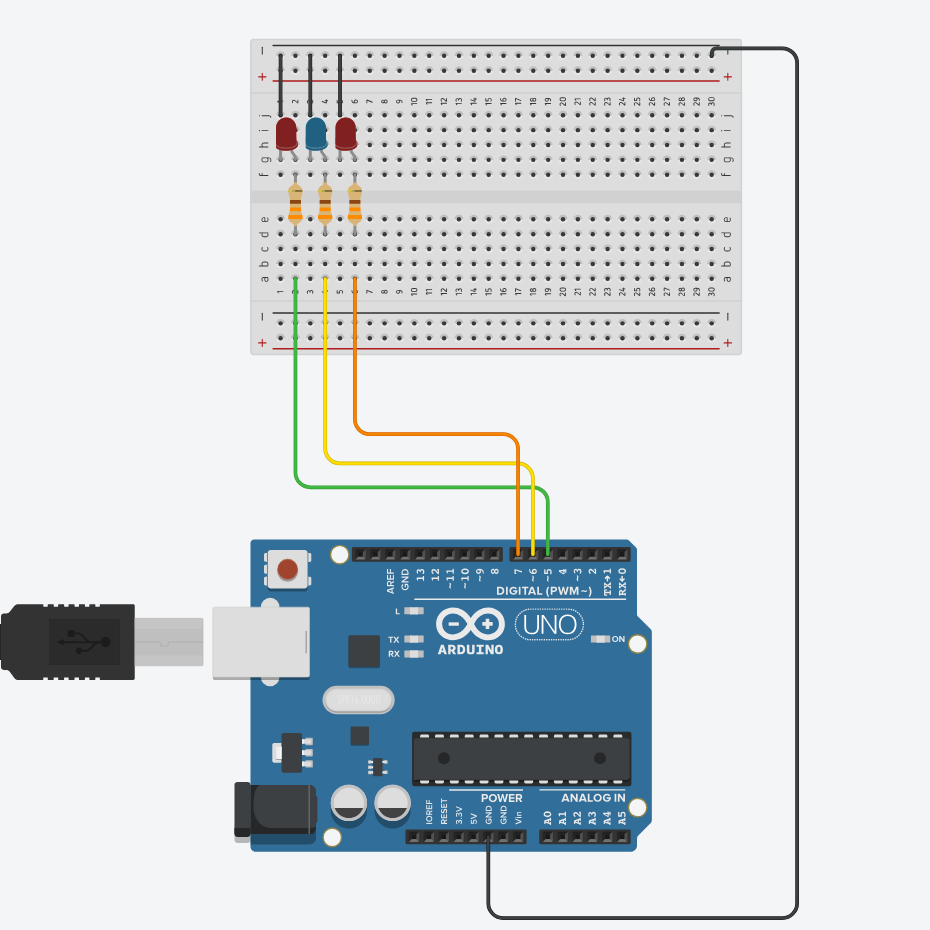
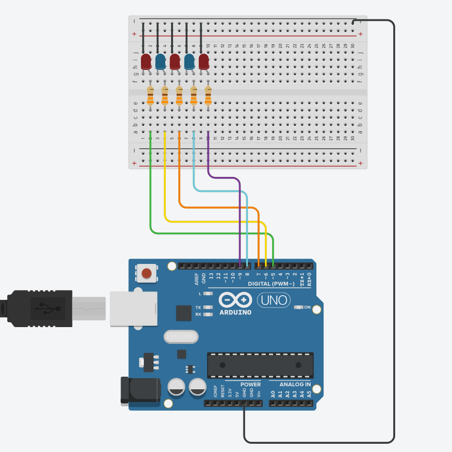
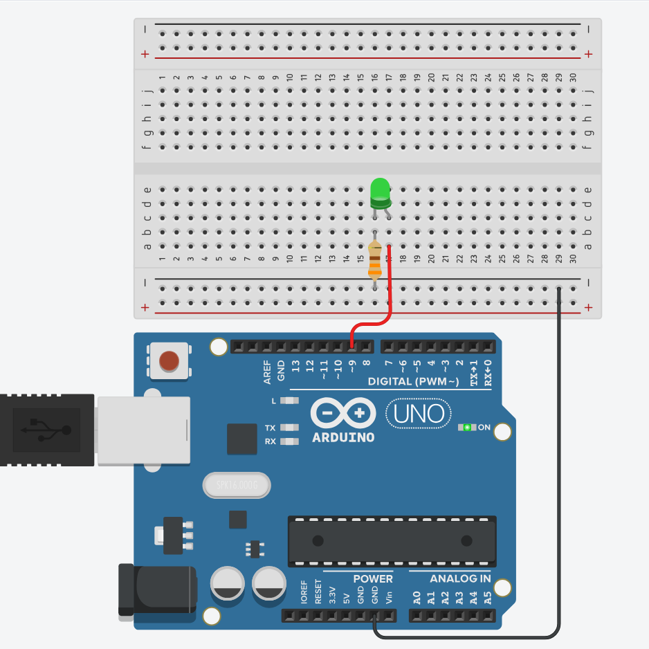
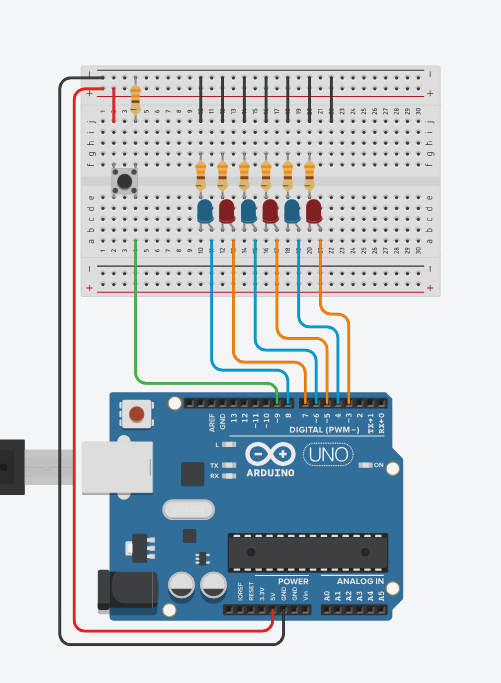
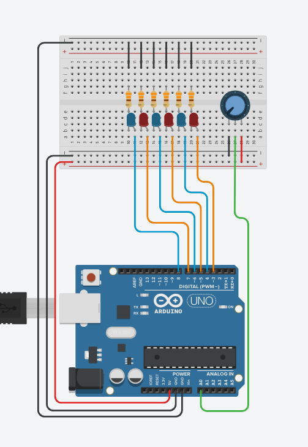
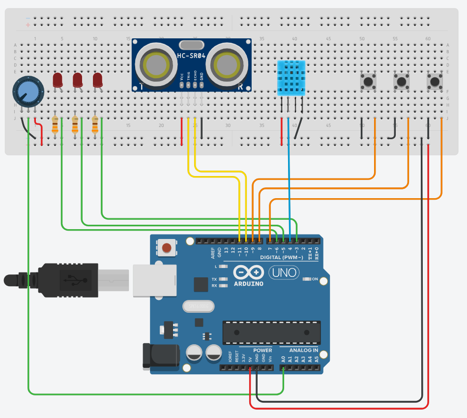

<h1 align="center">Arduino Sample code</h1>
<div align="center">

  
[Turkish](README.tr.md) | [Phone Version](README_Phone.md) 

</div>

<br>
<br>
<br>

# 1 | Led operation (Simple)

<table>
  <tr>
     <td width="60%">
       <p align="center"> </img>
    </td>
    <td width="50%"> 
      
```ino
void setup() {

  pinMode(5, OUTPUT);
  pinMode(6, OUTPUT);
  pinMode(7, OUTPUT);
}

void loop() {

  digitalWrite(5, HIGH);
  delay(711);
  digitalWrite(5, LOW);
  delay(711);
  digitalWrite(6, HIGH);
  delay(711);
  digitalWrite(6, LOW);
  delay(711);
  digitalWrite(7, HIGH);
  delay(711);
  digitalWrite(7, LOW);
  delay(711);
}
```
    
  </td>
  </tr>
</table>

# 2 | Led operation (For loop)

<table>
  <tr>
     <td width="60%">
       <p align="center"> </img>
    </td>
    <td width="50%"> 
      
```ino
void setup() {

  pinMode(5, OUTPUT);
  pinMode(6, OUTPUT);
  pinMode(7, OUTPUT);
  pinMode(8, OUTPUT);
  pinMode(9, OUTPUT);

  digitalWrite(5, HIGH);
  delay(711);
  digitalWrite(5, LOW);
}
void loop() {

  for (int A = 6; A < 9; A++) {

    digitalWrite(A, HIGH);
    delay(711);
    digitalWrite(A, LOW);
  }

  for (int B = 9; B > 4; B--) {

    digitalWrite(B, HIGH);
    delay(711);
    digitalWrite(B, LOW);
  }
}
```
  </td>
  </tr>
</table>

# 3 | Changing the intensity of the led with analog input 

<table>
  <tr>
     <td width="60%">
       <p align="center"> </img>
    </td>
    <td width="50%"> 
      
```ino
int Y = 9;

void setup() {

  pinMode(Y, OUTPUT);
}

void loop() {
  analogWrite(Y, 255);
  delay(777);
  analogWrite(Y, 100);
  delay(777);
  analogWrite(Y, 0);
  delay(777);
}
}
```
    
  </td>
  </tr>
</table>

# 4 | LED operation with button  

<table>
  <tr>
     <td width="60%">
       <p align="center"> </img>
    </td>
    <td width="50%"> 
      
```ino
const int button = 9;
int buttonState = 0;

void setup() {
  pinMode(button, INPUT);
  pinMode(3, OUTPUT);
  pinMode(4, OUTPUT);
  pinMode(5, OUTPUT);
  pinMode(6, OUTPUT);
  pinMode(7, OUTPUT);
  pinMode(8, OUTPUT);

  Serial.begin(9600);
}

void loop() {

  buttonState = digitalRead(button);
  Serial.println(buttonState);
  delay(100);


  if (buttonState == HIGH) {
    for (int x = 8; x >= 3; x--) {
      digitalWrite(x, HIGH);
      delay(77);
    }

    for (int y = 8; y >= 3; y--) {

      digitalWrite(y, LOW);
      delay(77);
    }

    for (int z = 3; z <= 8; z++) {
      digitalWrite(z, HIGH);
      delay(77);
    }

    for (int f = 3; f <= 8; f++) {

      digitalWrite(f, LOW);
      delay(77);
    }
  }
}

```
    
  </td>
  </tr>
</table>


# 5 | Led control with potentiometer

<table>
  <tr>
     <td width="60%">
       <p align="center"> </img>
    </td>
    <td width="50%"> 
      
```ino
#define pot A0
int potstate = 0;

void setup() {
  pinMode(pot, INPUT);
  pinMode(3, OUTPUT);
  pinMode(4, OUTPUT);
  pinMode(5, OUTPUT);
  pinMode(6, OUTPUT);
  pinMode(7, OUTPUT);
  pinMode(8, OUTPUT);

  Serial.begin(9600);
}

void loop() {

  potstate = analogRead(pot);
  potstate = map(potstate, 0, 1023, 0, 6);
  Serial.println(potstate);
  delay(100);


  if (potstate > 0) {
    digitalWrite(3, HIGH);
  } else if (potstate < 1) {
    digitalWrite(3, LOW);
  }

  if (potstate > 1) {
    digitalWrite(4, HIGH);
  } else if (potstate < 2) {
    digitalWrite(4, LOW);
  }

  if (potstate > 2) {
    digitalWrite(5, HIGH);
  } else if (potstate < 3) {
    digitalWrite(5, LOW);
  }

  if (potstate > 3) {
    digitalWrite(6, HIGH);
  } else if (potstate < 4) {
    digitalWrite(6, LOW);
  }

  if (potstate > 4) {
    digitalWrite(7, HIGH);
  } else if (potstate < 5) {
    digitalWrite(7, LOW);
  }

  if (potstate > 5) {
    digitalWrite(8, HIGH);
  } else if (potstate < 6) {
    digitalWrite(8, LOW);
  }
}

```
    
  </td>
  </tr>
</table>

# 6 | Led control with sensors

<table>
  <tr>
     <td width="60%">
       <p align="center"> </img>
    </td>
    <td width="50%"> 
      
```ino
#include <DHT11.h>
#include <NewPing.h>

#define led1_pin 6
#define led2_pin 5
#define led3_pin 3

#define Pot_Button_pin 7
#define Sonnar_Button_pin 8
#define DHT11_Button_pin 9

#define ECHO_PIN 10
#define TRIGGER_PIN 11
#define DHT11_pin 4
#define Pot_pin A0

#define MAX_DISTANCE 200
NewPing sonar(TRIGGER_PIN, ECHO_PIN, MAX_DISTANCE);
DHT11 sensor(DHT11_pin);


void PotCode(int potvalue) {
  ledreset();
  if (potvalue > 0) digitalWrite(led1_pin, 1);
  if (potvalue < 340) digitalWrite(led1_pin, 0);

  if (potvalue > 340) digitalWrite(led2_pin, 1);
  if (potvalue < 680) digitalWrite(led2_pin, 0);

  if (potvalue > 680) digitalWrite(led3_pin, 1);
  if (potvalue < 1020) digitalWrite(led3_pin, 0);
}

void DHT11Code(int temperature) {
  ledreset();
  if (temperature > 20) digitalWrite(led1_pin, 1);
  else if (temperature > 32) digitalWrite(led1_pin, 0);

  if (temperature > 32) digitalWrite(led2_pin, 1);
  else if (temperature > 40) digitalWrite(led2_pin, 0);

  if (temperature > 40) digitalWrite(led3_pin, 1);
  else if (temperature > 60) digitalWrite(led3_pin, 0);
}

void SonarCode(int sonarvalue) {
  ledreset();
  if (sonarvalue >= 0) digitalWrite(led3_pin, 0);
  if (sonarvalue <= 5) digitalWrite(led3_pin, 1);

  if (sonarvalue > 5) digitalWrite(led2_pin, 0);
  if (sonarvalue <= 10) digitalWrite(led2_pin, 1);

  if (sonarvalue > 10) digitalWrite(led1_pin, 0);
  if (sonarvalue < 20) digitalWrite(led1_pin, 1);
}

void ledreset() {

  digitalWrite(led1_pin, 0);
  digitalWrite(led2_pin, 0);
  digitalWrite(led3_pin, 0);
}

void setup() {

  pinMode(DHT11_pin, INPUT);

  pinMode(Pot_Button_pin, INPUT_PULLUP);
  pinMode(Sonnar_Button_pin, INPUT_PULLUP);
  pinMode(DHT11_Button_pin, INPUT_PULLUP);

  pinMode(led1_pin, OUTPUT);
  pinMode(led2_pin, OUTPUT);
  pinMode(led3_pin, OUTPUT);
}


void loop() {

  int potvalue = analogRead(Pot_pin);
  int temperature = sensor.readTemperature();
  int sonarvalue = sonar.ping_cm();

  if (digitalRead(Pot_Button_pin) == 0) {
    PotCode(potvalue);
  }

  if (digitalRead(DHT11_Button_pin) == 0) {
    DHT11Code(temperature);
  }

  if (digitalRead(Sonnar_Button_pin) == 0) {
    SonarCode(sonarvalue);
  }
}

```
    
  </td>
  </tr>
</table>


